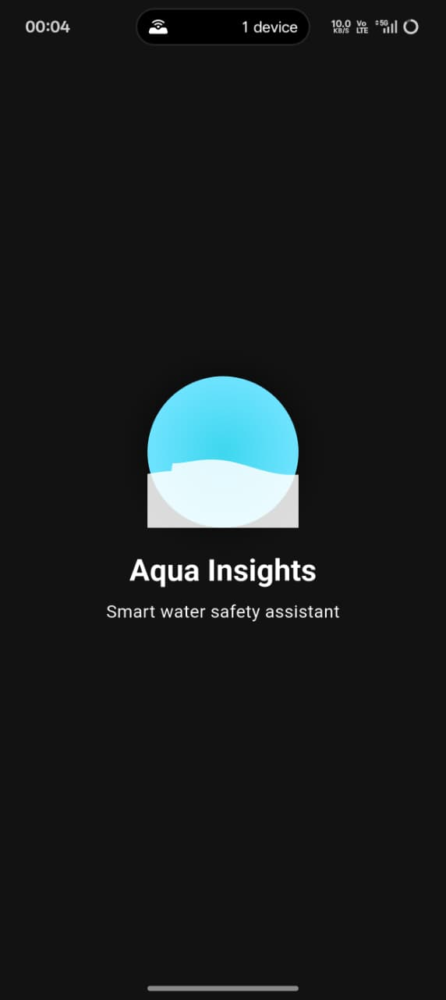
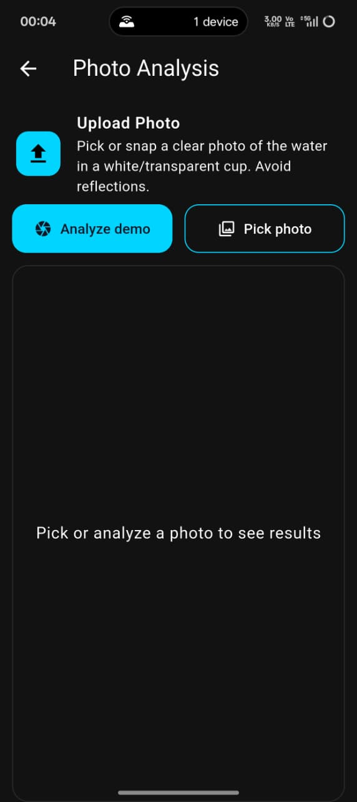
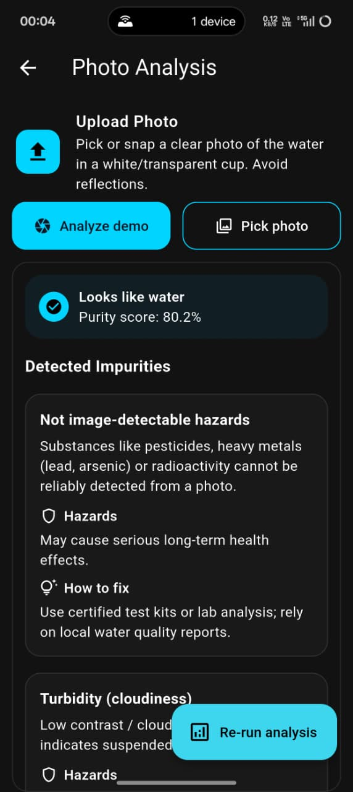
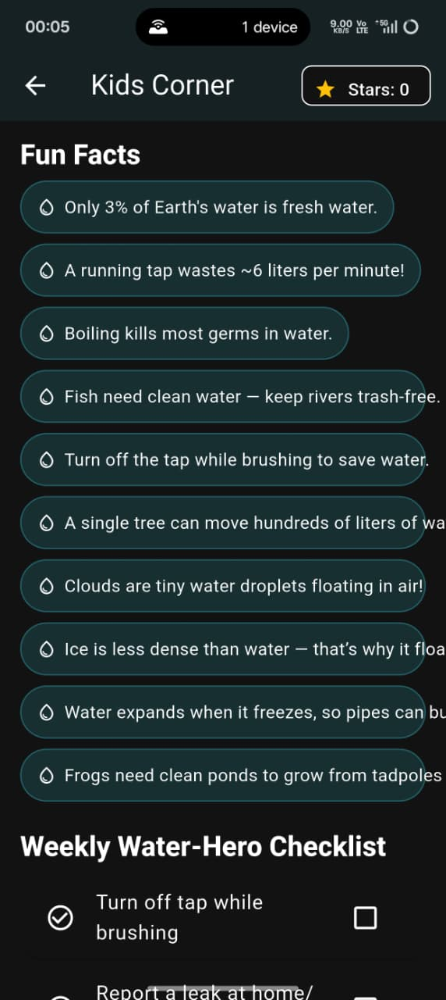
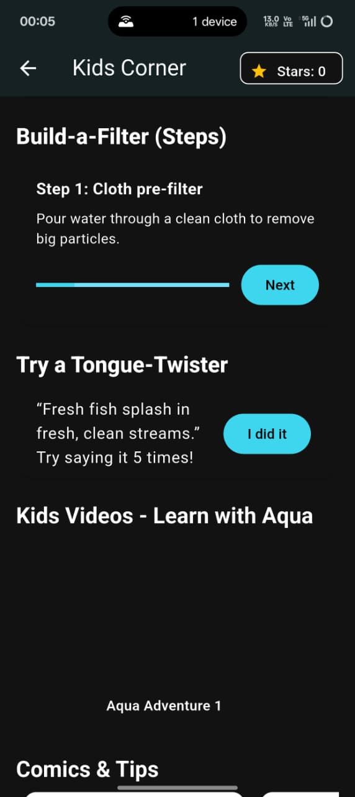
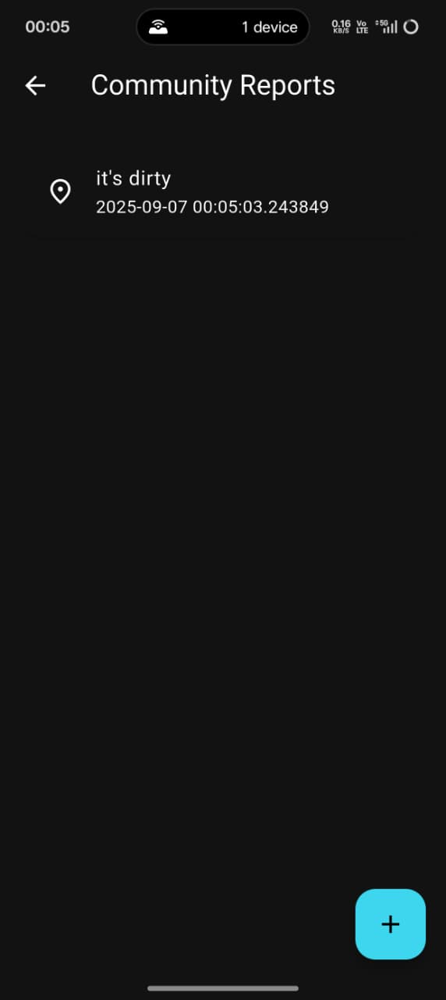
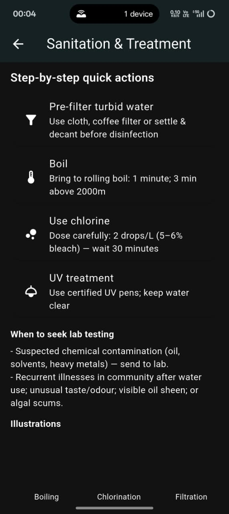
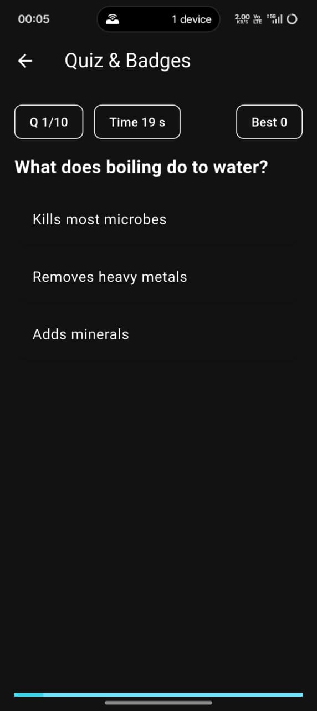
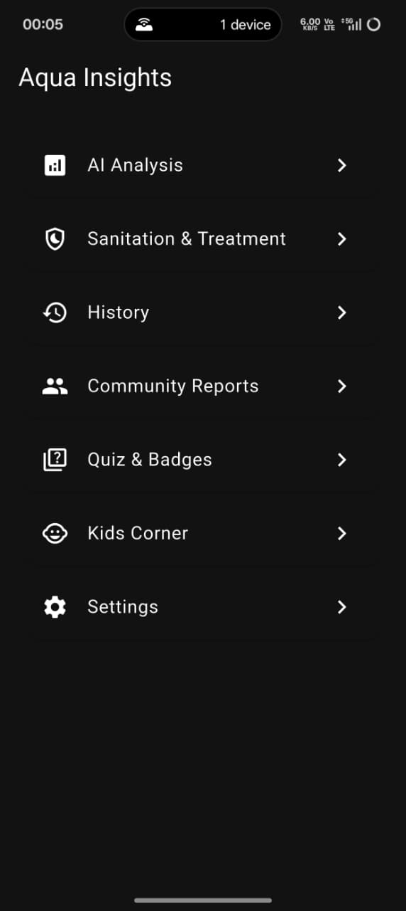

# 🌊 AquaInsights Pro

AquaInsights Pro is a *citizen-centric water quality monitoring and reporting application*.  
It empowers citizens and children to monitor water quality in real time, report issues, and learn about sanitation & treatment methods through an engaging and animated user experience.  

---

## 👥 Team Members
- BOMMELLA ROHAN - CS24B007
- G KARTHIK GOUD - CS24B011
- K THRINESH - CS24B017
- KODALI HARSHITH - CS24B019
- V SANTOSH - CS24B050  

---

## 📱 Features

### -> 📷 Quick Scan & Analyze  
- Camera/Gallery input with animated overlay.  
- Detects contaminants and shows WQI with confidence levels.  
- Actions: Save Report, Share, Retry.  

### -> 📝 Citizen Reporting  
- Multi-step reporting form: Photo/Video, Location Pin, Severity Slider, Voice/Text description.  
- Submission triggers animated confirmation + eco-coins reward.  

### -> 🗺 Interactive Map  
- Color-coded pins (Green/Yellow/Red) show water safety.  
- Ripple animations on new pins.  
- Filters for severity, category, and date.  

### -> 🎮 Kids Corner  
- Tabs: Stories, Comics, Tips, Games.  
- Animated comics & mascot Aqua for learning.  
- Mini-games like *“Save the River”* with eco-coin rewards.  

### -> 🧪 Sanitation & Treatment  
- Illustrated guides for Household, Community, and Industrial methods.  
- Swipeable carousel with step-by-step visuals.  
- Share/Download options.  

### -> 🔔 Notifications  
- Droplet-shaped alerts.  
- Urgent alerts vibrate + glow.  
- Actions: View Map, Dismiss, Mark as Read.  

### -> ⚙ Settings  
- Dark Mode, Language toggle (EN/HI), Accessibility options.  
- Manage Offline Reports & Privacy settings.  

---

## 🛠 App Flow  
1. Splash Screen → Ripple animation with logo.  
2. Onboarding Slides → Intro to app, scan, rewards.  
3. Home Dashboard → Central hub with WQI meter + quick actions.  
4. Scan & Report → Capture water sample or submit issue.  
5. Kids Corner → Fun learning zone.  
6. Sanitation & Treatment → Awareness guides.  
7. Settings → Customize experience.  

---

## 🖼 Images  

### App Logo  
  

### Dashboard  
  

### Scan & Analyze  
  

### Kids Corner  
 

### Reporting  
  

### Sanitation & Treatment  
  

### Quiz And Badges

### Main Page 

---

## 💻 Tech Flow  

### Tech Stack  
- *Frontend:* Flutter / Dart   
- *APIs:* Google Maps API, Custom Water Quality API  
- *Animations:* Lottie + Custom Animations  

### Contributions  
TEAM CONTRIBUTIONS :
ROHAN , HARSHITH :
- Developed WQI Dashboard & Quick Scan.  
- Implemented Reporting System (photo, video, voice, location).  
- Contributed to Backend Integration.  
- Wrote documentation & setup repository.  

KARTHIK , THRINESH , SANTOSH :
- Designed UI/UX (animations, Kids Corner, gamification).  
- Built Kids Corner (comics, mascot, games).  
- Worked on Sanitation & Treatment modules.  
- Managed Testing, Accessibility, and Deployment. AND OTHER

---

## 📌 Overview  
Our application ensures *community-driven water safety. By combining **real-time monitoring, citizen reporting, and playful learning, AquaInsights Pro is both a **serious tool for awareness* and a *fun app for children*.  

---

=======
>>>>>>> 6d34677 (Updated UI)

